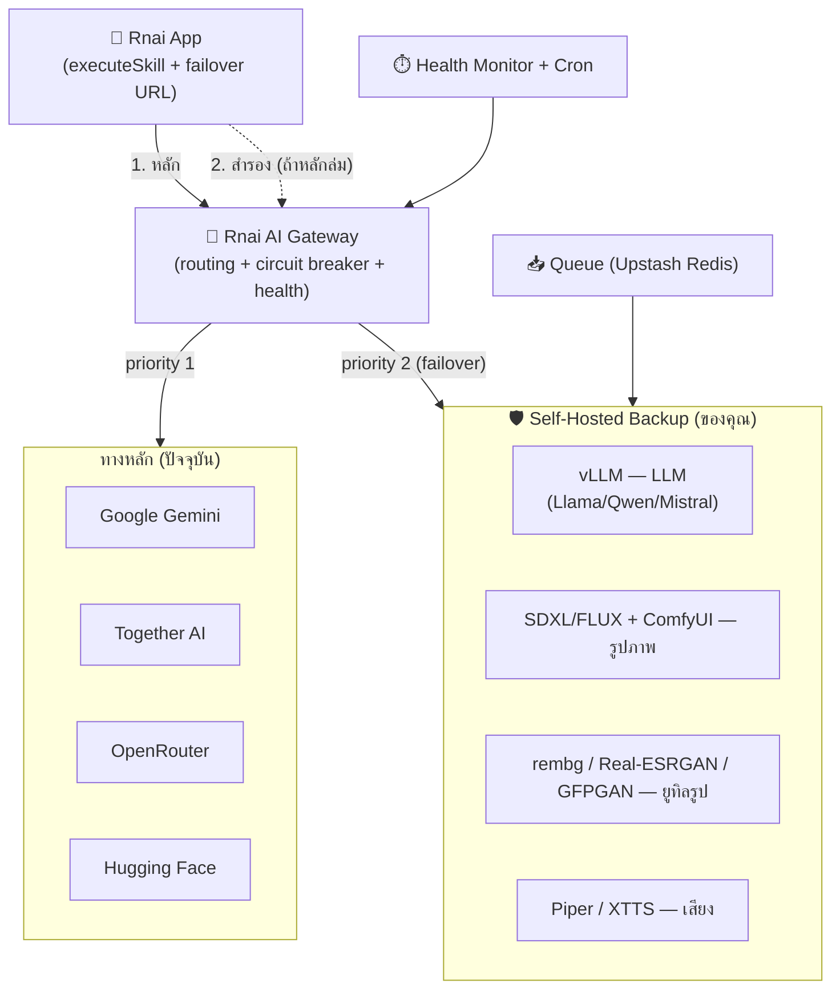

# Rnai AI — พิมพ์เขียว Self-Hosted Backup Server + Auto Failover

จัดทำ 2026-06-17 · สำหรับแอป Rnai.io Mobile v2.0 และแพลตฟอร์ม `rnai-io.vercel.app`

เป้าหมาย: มี **"โมเดล Rnai" ของตัวเอง** ที่รันบนคลาวด์ และทำงานเป็น **ระบบสำรองอัตโนมัติ** เมื่อผู้ให้บริการ AI ภายนอก (Gemini/Together/OpenRouter/HF) หรือ backend หลักล่ม โดยผู้ใช้แทบไม่รู้สึกถึงการสะดุด

---

## 1. ภาพรวมสถาปัตยกรรม

**หลักการ:** แอปไม่ผูกกับผู้ให้บริการรายใดรายหนึ่ง ทุกคำขอผ่าน Gateway ที่เลือกเส้นทางตามสุขภาพของแต่ละ provider ถ้าทางหลักล่ม Gateway สลับไป backup ที่คุณ host เองโดยอัตโนมัติ และถ้า Gateway/backend หลักทั้งก้อนล่ม แอปจะสลับไป URL สำรองเอง (ทำเสร็จแล้วใน `app/services/api.ts`)

มี 3 ชั้นของความทนทาน:
1. **ในแอป** — `executeSkill` ลองเรียก `baseUrl` หลักก่อน ถ้า network/timeout/5xx ก็ลอง `fallbackBaseUrls` (ตั้งผ่าน env `EXPO_PUBLIC_API_FALLBACK_URL`)
2. **ใน Gateway** — เลือก provider ตามลำดับ + circuit breaker + health check
3. **Backup server** — โมเดลเปิดที่คุณรันเอง เป็นปลายทางสุดท้ายที่ไม่พึ่งใคร

---

## 2. โมเดลที่ควรใช้ในแต่ละขอบเขต (เลือก open-weight เพื่อ self-host)

| ขอบเขต | สกิลที่รองรับ | โมเดลแนะนำ (เปิด) | เสิร์ฟด้วย |
|---|---|---|---|
| LLM / ข้อความ | text-gen, text-sum, text-trans, text-rewrite, text-grammar, text-code, text-hashtag, website-gen, แชท | Llama 3.1 8B/70B · Qwen2.5 7B/32B · Mistral · Gemma 2 | **vLLM** (OpenAI-compatible API) หรือ Ollama (ง่ายกว่า) |
| รูปภาพ — สร้าง/แก้/สไตล์ | image-gen, image-edit, stylize | SDXL · FLUX.1-schnell/dev | **ComfyUI** หรือ Diffusers (FastAPI) |
| รูปภาพ — ยูทิล | remove-bg | rembg (U²-Net) | CPU/GPU เบาๆ |
| | upscale | Real-ESRGAN | GPU |
| | face-restore | GFPGAN / CodeFormer | GPU |
| วิเคราะห์รูป (vision) | image-describe | Llava / Qwen2-VL | vLLM (vision) |
| เสียง (TTS) | audio-tts | **Piper** (เบา, CPU) · XTTS-v2 / F5-TTS (คุณภาพสูง, GPU) | FastAPI |
| เว็บไซต์ | website-gen | ใช้ LLM ตัวเดียวกับข้อความ (สร้าง HTML) | vLLM |

> เคล็ดลับ: website-gen และสกิลข้อความทั้งหมด **ใช้ LLM ตัวเดียวกันได้** ทำให้ backup LLM ตัวเดียวครอบคลุม 8 สกิล

---

## 3. ตัวเลือกที่ host (Backup ควรเป็น "always-on" หรือ "scale-to-zero")

| รูปแบบ | ตัวอย่างผู้ให้บริการ | ข้อดี | ข้อเสีย |
|---|---|---|---|
| **Serverless GPU (scale-to-zero)** | RunPod Serverless, Modal, Replicate, Beam | จ่ายตามใช้จริง ถูกเมื่อโหลดต่ำ | cold start 10–60 วิ |
| **GPU เปิดตลอด (warm)** | RunPod Pod, Lambda, AWS/GCP GPU, Fly.io GPU | ตอบสนองทันที | แพง (~$0.5–$2+/ชม. = ~$360–$1500/เดือน/GPU) |
| **CPU เปิดตลอด (ของเบา)** | Railway, Render, Fly.io, VPS | ถูกมาก เหมาะกับ Piper/rembg/LLM เล็ก (llama.cpp) | ไม่ไหวงานหนัก |
| **Gateway (stateless)** | Vercel/Cloudflare Workers หรือรวมใน backend เดิม | ไม่ต้องดูแล | รันโมเดลเองไม่ได้ |

**สำคัญ:** backend ปัจจุบันอยู่บน **Vercel ซึ่งเป็น serverless — รันโมเดลเองไม่ได้** ดังนั้น backup server ต้องเป็น host แยกตามตารางด้านบน ส่วน Gateway (ตรรกะ routing) จะวางใน Vercel functions เดิมก็ได้ เพราะเป็นแค่การ proxy/เลือกเส้นทาง

**คอมโบที่คุ้มสุด:** Gateway บน Vercel → ทางหลักคือ provider ภายนอก → backup = **(ก)** CPU เปิดตลอดราคาถูก (Piper TTS + rembg + LLM เล็ก) ที่พร้อมเสมอ + **(ข)** Serverless GPU (SDXL/LLM ใหญ่) แบบ scale-to-zero สำหรับงานหนัก

---

## 4. ตรรกะ Failover + Circuit Breaker

แต่ละสกิลมี "registry" ของ provider เรียงตามลำดับความสำคัญ + สถานะสุขภาพ:

1. **ลำดับสำรอง (priority chain):** หลัก → สำรอง 1 → … → backup ที่ host เอง
2. **Circuit breaker:** ถ้า provider ล้มเหลวติดกัน N ครั้ง → "เปิดวงจร" (หยุดส่งชั่วคราว) → หลังเวลาคูลดาวน์ลองใหม่แบบ half-open
3. **Health check:** cron เรียก endpoint สุขภาพของแต่ละ provider เป็นระยะ + ตรวจตอนใช้งานจริง
4. **Timeout + retry + fallback:** ภายใน provider ลองซ้ำสำหรับ network/timeout/5xx แล้วจึงข้ามไป provider ถัดไป
5. **Graceful degradation:** ถ้า backup ของขอบเขตนั้นล่มด้วย → คืน error ที่ชัดเจน (สองภาษา) ไม่แกล้งทำงาน

ดูโค้ดอ้างอิงที่ `docs/reference/ai-gateway-router.ts` (พร้อมปรับไปใช้ใน backend Next.js ได้)

---

## 5. ระบบอัตโนมัติ & รองรับเหตุไม่คาดฝัน

- **Queue งานหนัก** — งานสร้างภาพ/วิดีโอใส่คิว (Upstash Redis ที่มีอยู่แล้ว) + worker บน backup server เพื่อกันค้างตอนโหลดพุ่ง
- **Health monitoring + alert** — uptime check (เช่น Better Stack/UptimeRobic) + แจ้งเตือนเมื่อ circuit เปิด
- **Auto-scale / auto-restart** — host platform จัดการ (RunPod/Modal scale ตามคิว; Railway/Render restart เมื่อ crash)
- **Warm pool** — เปิด GPU ขั้นต่ำ 1 ตัวให้พร้อมสำหรับเส้นทางวิกฤต เพื่อลด cold start ตอน failover
- **สถานะระบบจริง** — เพิ่ม `/api/v1/status` ให้แอปเรียก (แทนค่าคงที่ "🟢 ปกติ" ในโปรไฟล์) แสดงว่ากำลังใช้ทางหลักหรือ backup

---

## 6. แผนทยอยทำ (Rollout)

| เฟส | สิ่งที่ทำ | ต้นทุน | ได้อะไร |
|---|---|---|---|
| **0 — ทำแล้ว** | failover URL ในแอป (`api.ts`) | $0 | แอปสลับ backend สำรองได้เอง |
| **1** | Gateway + multi-provider failover + circuit breaker (ไม่มี GPU) | ต่ำ | ทนทานทันทีเมื่อ provider รายใดล่ม |
| **2** | CPU backup เปิดตลอด: Piper TTS + rembg + LLM เล็ก (llama.cpp) | ต่ำ (~$10–30/เดือน) | สำรองพื้นฐานพร้อมเสมอ |
| **3** | Serverless GPU backup: SDXL/FLUX + LLM ใหญ่ (vLLM) scale-to-zero | กลาง (จ่ายตามใช้) | สำรองงานหนักครบทุกขอบเขต |
| **4** | Warm capacity + monitoring + auto-scale + (เลือก) fine-tune โมเดลให้เป็น "Rnai" จริง | สูงขึ้น | เร็ว ทนทาน และมีเอกลักษณ์ |

แนะนำเริ่มเฟส 1–2 ก่อน เพราะได้ความทนทานสูงสุดต่อค่าใช้จ่ายต่ำสุด แล้วค่อยขยับเฟส 3 เมื่อมีผู้ใช้มากพอ

---

## 7. สิ่งที่ต้องเตรียม (คุณต้องทำเอง — ผมตั้งให้จากที่นี่ไม่ได้)

1. เปิดบัญชี host สำหรับ backup (RunPod/Modal/Render ฯลฯ) + GPU/CPU
2. Deploy บริการตาม `docs/reference/docker-compose.backup.yml` แล้วได้ URL ของ Gateway สำรอง
3. ตั้ง env ในแอป: `EXPO_PUBLIC_API_FALLBACK_URL=https://<gateway-สำรอง>`
4. นำ `ai-gateway-router.ts` ไปวางใน backend `rnai-platform` แล้วปรับ provider/endpoint จริง
5. เพิ่ม `/api/v1/status` และต่อ monitoring/alert
